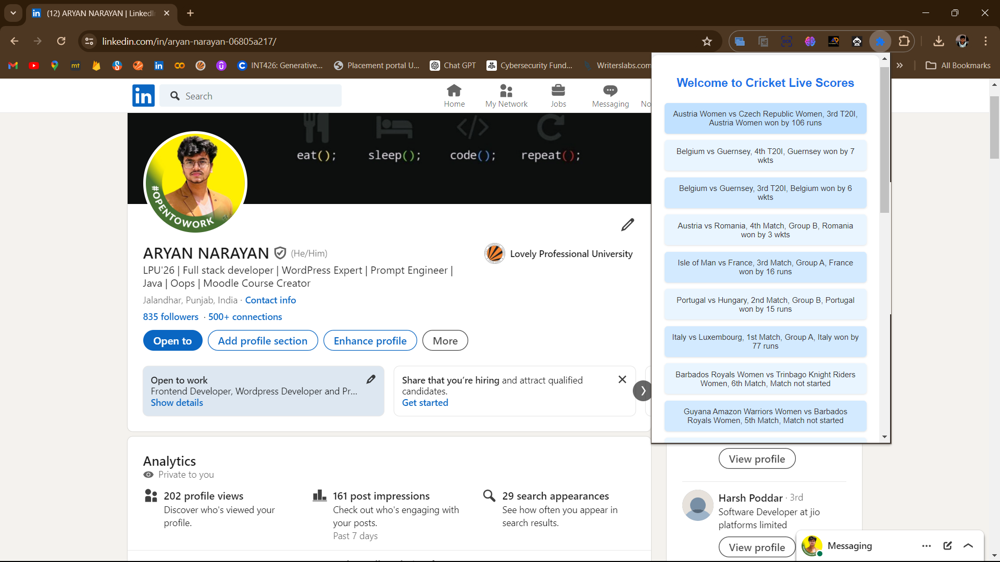

# RealTime Cricket Score Extension

Welcome to the **RealTime Cricket Score Extension**! This Chrome extension allows you to stay updated with live cricket scores and match statuses directly from your browser. No need to visit multiple websites or navigate through apps—get the latest scores at your fingertips.

## Features

- **Live Cricket Scores**: Get real-time updates on ongoing cricket matches.
- **Match Status**: See the current status of each match (e.g., in-progress, completed).
- **User-Friendly Interface**: A clean, modern, and responsive design that is easy to use.
- **Quick Access**: Access scores with a single click from your browser's toolbar.

## Screenshots



## Installation

1. Clone the repository to your local machine:
    ```bash
    git clone https://github.com/yourusername/realtime-cricket-score-extension.git
    ```
2. Open Chrome and navigate to `chrome://extensions/`.
3. Enable "Developer mode" by toggling the switch in the top-right corner.
4. Click on "Load unpacked" and select the cloned directory.

## Usage

1. Click on the extension icon in the Chrome toolbar.
2. View the list of current cricket matches and their statuses.

## Technologies Used

- **HTML**: Structure and layout of the extension.
- **CSS**: Styling and appearance.
- **JavaScript**: Fetching live data from the cricket API and updating the UI.
- **CricAPI**: Source of live cricket match data.

## Contributing

Contributions are welcome! If you have suggestions for improvements or new features, feel free to create an issue or submit a pull request.

1. Fork the repository.
2. Create a new branch (`git checkout -b feature-branch`).
3. Make your changes.
4. Commit your changes (`git commit -m 'Add new feature'`).
5. Push to the branch (`git push origin feature-branch`).
6. Open a pull request.

## License

This project is licensed under the MIT License.

## Author

- **Aryan Narayan**

Stay up-to-date with live cricket scores and enjoy the game like never before with the RealTime Cricket Score Extension!
